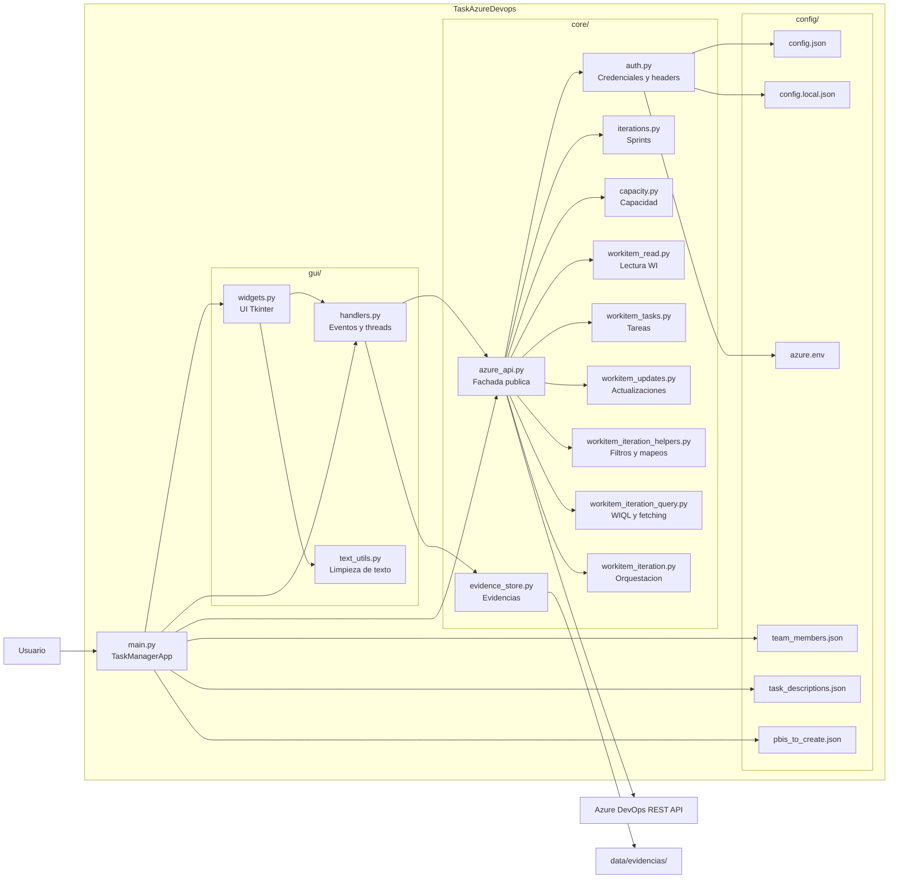

# Skill: diagram-app-mermaid

Genera un diagrama Mermaid fiel a la arquitectura real de TaskAzureDevops. La skill debe inspeccionar documentación y código antes de dibujar, evitar inventar módulos y producir un diagrama que renderice correctamente.

## Cuándo usar esta skill

- El usuario pide un diagrama de toda la aplicación
- El usuario pide un mapa visual de arquitectura o módulos
- El usuario quiere entender cómo se conectan GUI, core, configuración y Azure DevOps
- El usuario necesita Mermaid para documentación técnica o revisión de arquitectura

## Objetivo

Producir uno de estos resultados, según el nivel de detalle pedido:

1. Un overview único en Mermaid con la arquitectura completa
2. Un overview más uno o dos diagramas complementarios si el sistema no cabe bien en uno solo
3. Un diagrama de flujo específico, por ejemplo búsqueda de PBI, creación de tareas, capacidad, evidencias o iteraciones

## Fuentes que deben revisarse primero

Lee primero estas fuentes y usa el código real como fuente de verdad si hay discrepancias:

- `README.md`
- `TECHNICAL_GUIDE.md`
- `main.py`
- `gui/widgets.py`
- `gui/handlers.py`
- `core/__init__.py`
- `core/azure_api.py`
- módulos `core/` relevantes para la funcionalidad pedida

## Arquitectura base de este proyecto

Usa esta estructura como punto de partida y ajústala si el código actual la amplía:

- `main.py` contiene `TaskManagerApp` y coordina la aplicación
- `gui/widgets.py` construye la UI Tkinter
- `gui/handlers.py` maneja eventos, threads y llamadas a la capa core
- `gui/text_utils.py` encapsula limpieza o transformación de texto
- `core/azure_api.py` es la fachada pública estable
- `core/auth.py` resuelve credenciales, config y headers
- `core/iterations.py` maneja sprints e iteraciones
- `core/capacity.py` maneja capacidad y días libres
- `core/workitem_read.py`, `core/workitem_tasks.py`, `core/workitem_updates.py` cubren lectura, creación y actualización de work items
- `core/workitem_iteration_helpers.py`, `core/workitem_iteration_query.py`, `core/workitem_iteration.py` cubren consultas por iteración
- `core/evidence_store.py` maneja evidencias técnicas
- `config/` contiene credenciales locales, miembros, descripciones y PBIs predefinidos
- Azure DevOps REST API es la dependencia externa principal

## Procedimiento

### 1. Determinar el tipo de diagrama

Si el usuario no concreta, elige por defecto `flowchart LR` con subgraphs.

- Si pide "toda la aplicación": crea un diagrama de arquitectura completa
- Si pide "flujo": crea `flowchart` o `sequenceDiagram`
- Si pide responsabilidades por módulo: crea `flowchart` por capas y dependencias
- Si pide interacción temporal: crea `sequenceDiagram`

### 2. Inventariar componentes reales

Antes de redactar Mermaid, identifica:

- punto de entrada
- módulos GUI
- módulos core exportados públicamente
- configuración y archivos de datos relevantes
- integraciones externas
- flujos críticos del negocio

No incluyas módulos no presentes en el repo.

### 3. Elegir granularidad adecuada

- Si el usuario quiere vista ejecutiva: agrupa por capas
- Si quiere detalle técnico: desglosa módulos de `core/`
- Si el diagrama se vuelve ilegible: entrega un overview y luego diagramas complementarios

### 4. Escribir el Mermaid

Reglas de salida:

- Usa nombres legibles y estables
- Agrupa con `subgraph` cuando ayude a la lectura
- Etiqueta flechas con verbos concretos: `lee`, `delega`, `invoca`, `persiste`, `consulta`
- Mantén una única dirección general del flujo
- Evita cruces innecesarios
- No mezcles demasiados niveles de abstracción en el mismo bloque

### 5. Validar antes de responder

Comprueba:

- que el código Mermaid sea sintácticamente válido
- que cada relación exista en el código o en la documentación técnica
- que `main.py` conecte con GUI y no directamente con todos los submódulos internos salvo donde sea real
- que `core/azure_api.py` aparezca como fachada cuando aplique
- que `config/` y Azure DevOps queden reflejados si forman parte del flujo pedido

## Plantilla recomendada para overview completo

## Variantes útiles

### Flujo de búsqueda y carga de un PBI

- Usuario inicia búsqueda en GUI
- `handlers.py` lanza thread
- `core.get_work_item` consulta Azure DevOps
- la UI se actualiza y luego se cargan tareas hijas

### Flujo de creación de tareas

- Usuario completa formulario
- `handlers.py` valida y resuelve usuario asignado
- `core.create_task_for_pbi` crea work item hijo
- Azure DevOps responde con ID y la UI recarga tareas

### Flujo de capacidad

- GUI selecciona iteración
- `handlers.py` pide capacidad y días off
- `core/capacity.py` consulta endpoints de sprint y capacidad
- la UI calcula o presenta horas disponibles por integrante

### Flujo de evidencias

- GUI consulta o edita evidencias
- handlers llaman a `evidence_store.py`
- el contenido se persiste en `data/evidencias/`

## Criterios de calidad

- El diagrama debe corresponder al estado actual del repo
- Debe ser entendible sin leer antes el código
- Debe distinguir claramente GUI, core, config e integración externa
- Debe evitar detalles irrelevantes para el nivel pedido
- Debe poder renderizarse en Mermaid sin correcciones manuales

## Qué no hacer

- No inventar clases, APIs o bases de datos inexistentes
- No poner todos los archivos del repo si no aportan valor arquitectónico
- No mezclar tests, scripts y documentación en el diagrama principal salvo petición explícita
- No exponer secretos ni valores reales de credenciales

## Respuesta recomendada

La respuesta final debe incluir:

1. Una frase breve indicando el tipo de diagrama elegido
2. El bloque Mermaid listo para copiar o renderizar
3. Si aplica, una nota breve sobre simplificaciones o módulos agrupados

## Prompts de ejemplo

- `Crear un diagrama Mermaid de toda la aplicación con capas y módulos reales`
- `Haz un overview Mermaid de TaskAzureDevops y añade el flujo de creación de tareas`
- `Genera un sequenceDiagram del flujo buscar PBI -> cargar tareas -> actualizar UI`
- `Quiero un Mermaid técnico que detalle main.py, gui y core/azure_api.py con sus delegaciones`